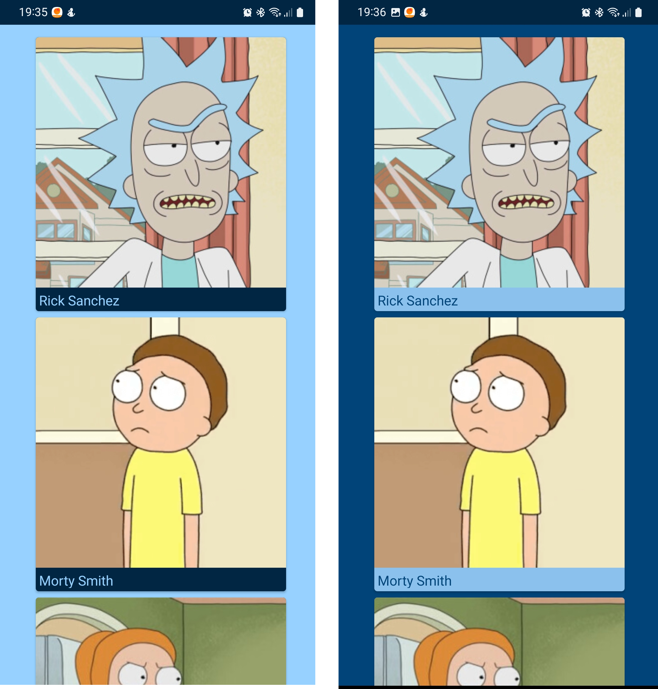

## Стек

* Kotlin, Coroutines
* Jetpack Compose
* Retrofit
* Dagger2
* Glide
* MVVM/Clean Arch

## Описание

### Что умеет приложение

    * Загружать фото и имена 20-ти персонажей
    * Отображать их на экране
    * Менять цвета в зависимости от темы
    * Удалять персонажа из загруженного списка (свайп влево)

### Что использовано

    * Данные загружаются с https://rickandmortyapi.com

### Скриншоты со светлой и темной темой

  

### Видео

https://user-images.githubusercontent.com/91427690/204150223-1f9feeb6-4a2b-49f9-b73f-6c39f19da4f2.mp4

